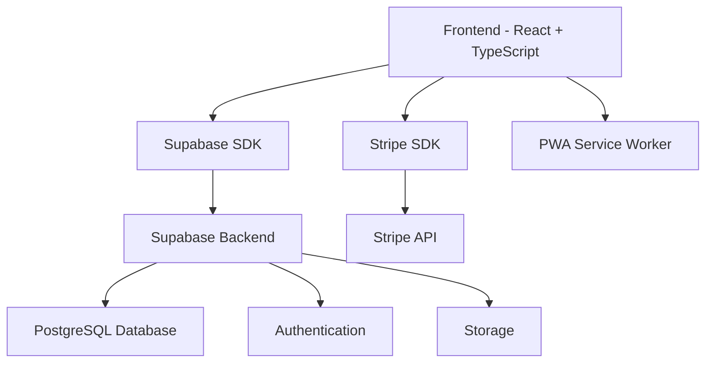

# 📋 CRM Parceiro - Documentação Completa

**Sistema de Gestão Completo para Oficinas Automotivas**

---

## 🎯 Visão Geral

O **CRM Parceiro** é uma solução completa de gestão para oficinas automotivas, desenvolvida com tecnologias modernas e integrada com os principais serviços de pagamento e comunicação do mercado.

### ✨ Principais Características

- 🚗 **Gestão Completa de Clientes e Veículos**
- 📅 **Sistema de Agendamentos Inteligente**
- 💰 **Integração com Stripe para Pagamentos**
- 📊 **Relatórios Avançados e Analytics**
- 💬 **Comunicação Multicanal (WhatsApp, Email, SMS)**
- 📱 **Progressive Web App (PWA)**
- 🔒 **Segurança e Autenticação Robusta**
- ☁️ **Hospedagem em Nuvem com Supabase**

---

## 📚 Documentação Disponível

### 1. 📖 [Manual do Usuário](./manual-usuario.md)
**Guia completo para usuários finais**
- Primeiros passos e configuração inicial
- Tutorial detalhado de cada módulo
- Dicas e boas práticas
- Solução de problemas comuns
- Guia do aplicativo PWA

### 2. 💳 [Integração com Stripe](./integracao-stripe.md)
**Documentação técnica para pagamentos**
- Configuração da conta Stripe
- Implementação frontend e backend
- Webhooks e segurança
- Testes e monitoramento
- Troubleshooting de pagamentos

### 3. 📊 [Sistema de Relatórios](./sistema-relatorios.md)
**Especificações dos relatórios avançados**
- Tipos de relatórios disponíveis
- Filtros personalizáveis
- Visualização de dados e gráficos
- Exportação em múltiplos formatos
- API de relatórios

### 4. 🚀 [Guia de Instalação](./guia-instalacao.md)
**Manual completo de instalação e configuração**
- Pré-requisitos e dependências
- Configuração do ambiente
- Deploy em produção
- Backup e monitoramento
- Manutenção do sistema

### 5. 🔌 [Documentação de APIs](./documentacao-apis.md)
**Referência completa das APIs**
- Endpoints disponíveis
- Autenticação e segurança
- Exemplos de integração
- SDKs e bibliotecas
- Webhooks e automações

---

## 🏗️ Arquitetura do Sistema

### Stack Tecnológico



**Frontend:**
- React 18 + TypeScript
- Tailwind CSS para estilização
- Vite para build e desenvolvimento
- PWA com Service Workers

**Backend:**
- Supabase (Backend-as-a-Service)
- PostgreSQL com Row Level Security
- Autenticação JWT integrada
- Storage para arquivos

**Integrações:**
- Stripe para pagamentos
- WhatsApp Business API
- SendGrid para emails
- Twilio para SMS

---

## 🚀 Início Rápido

### 1. Instalação

```bash
# Clone o repositório
git clone https://github.com/seu-usuario/crm-parceiro.git
cd crm-parceiro

# Instale as dependências
npm install

# Configure as variáveis de ambiente
cp .env.example .env
# Edite o arquivo .env com suas configurações
```

### 2. Configuração

```bash
# Configure o Supabase
# 1. Crie um projeto em supabase.com
# 2. Execute os scripts SQL fornecidos
# 3. Configure as variáveis SUPABASE_URL e SUPABASE_ANON_KEY

# Configure o Stripe
# 1. Crie uma conta em stripe.com
# 2. Obtenha as chaves de API
# 3. Configure STRIPE_PUBLIC_KEY e STRIPE_SECRET_KEY
```

### 3. Execução

```bash
# Desenvolvimento
npm run dev

# Build para produção
npm run build

# Preview da build
npm run preview
```

---

## 📋 Módulos do Sistema

### 🏠 Dashboard
- Visão geral dos indicadores
- Gráficos de performance
- Alertas e notificações
- Atalhos rápidos

### 👥 Gestão de Clientes
- Cadastro completo de clientes
- Histórico de serviços
- Comunicação integrada
- Documentos e anexos

### 🚗 Controle de Veículos
- Cadastro de veículos por cliente
- Histórico de manutenções
- Alertas de revisão
- Documentação do veículo

### 📅 Agendamentos
- Calendário interativo
- Agendamento online
- Lembretes automáticos
- Gestão de disponibilidade

### 📦 Estoque e Peças
- Controle de inventário
- Alertas de estoque baixo
- Gestão de fornecedores
- Relatórios de movimentação

### 💰 Financeiro
- Controle de receitas e despesas
- Fluxo de caixa
- Integração com pagamentos
- Relatórios financeiros

### 🔧 Ordens de Serviço
- Criação e gestão de OS
- Controle de status
- Orçamentos e aprovações
- Histórico completo

### 💬 Comunicação
- WhatsApp Business integrado
- Envio de emails
- SMS para clientes
- Templates personalizáveis

### 📊 Relatórios
- Relatórios financeiros
- Performance operacional
- Análise de clientes
- Exportação em múltiplos formatos

### ⚙️ Configurações
- Configurações da empresa
- Usuários e permissões
- Integrações
- Personalização

---

## 🔧 Configurações Essenciais

### Variáveis de Ambiente

```env
# Supabase
REACT_APP_SUPABASE_URL=https://seu-projeto.supabase.co
REACT_APP_SUPABASE_ANON_KEY=sua-chave-publica

# Stripe
REACT_APP_STRIPE_PUBLIC_KEY=pk_test_...
STRIPE_SECRET_KEY=sk_test_...

# WhatsApp
WHATSAPP_ACCESS_TOKEN=seu-token
WHATSAPP_PHONE_NUMBER_ID=seu-numero

# Email
SENDGRID_API_KEY=sua-chave-sendgrid
EMAIL_FROM=noreply@seudominio.com
```

### Configuração do Banco de Dados

O sistema utiliza PostgreSQL via Supabase com as seguintes tabelas principais:

- `users` - Usuários do sistema
- `customers` - Clientes da oficina
- `vehicles` - Veículos dos clientes
- `appointments` - Agendamentos
- `inventory` - Estoque de peças
- `service_orders` - Ordens de serviço
- `transactions` - Transações financeiras
- `payments` - Pagamentos via Stripe
- `communications` - Histórico de comunicações

---

## 🔐 Segurança

### Autenticação
- JWT tokens via Supabase Auth
- Refresh tokens automáticos
- Logout em múltiplas sessões
- Recuperação de senha

### Autorização
- Row Level Security (RLS)
- Políticas baseadas em roles
- Controle de acesso granular
- Auditoria de ações

### Dados
- Criptografia em trânsito (HTTPS)
- Criptografia em repouso
- Backup automático
- Conformidade com LGPD

---

## 📱 Progressive Web App (PWA)

### Características
- ✅ Instalável em dispositivos móveis
- ✅ Funciona offline (modo limitado)
- ✅ Notificações push
- ✅ Sincronização em background
- ✅ Interface responsiva

### Instalação
1. Acesse o sistema pelo navegador
2. Clique no ícone de instalação
3. Confirme a instalação
4. Use como app nativo

---

## 🚀 Deploy e Produção

### Opções de Deploy

**Vercel (Recomendado)**
```bash
npm install -g vercel
vercel --prod
```

**Netlify**
```bash
npm install -g netlify-cli
netlify deploy --prod --dir=build
```

**VPS/Servidor Próprio**
```bash
# Nginx + PM2
pm2 start ecosystem.config.js
```

### Monitoramento
- Health checks automáticos
- Logs centralizados
- Métricas de performance
- Alertas de erro

---

## 🔄 Integrações Disponíveis

### Pagamentos
- **Stripe:** Cartões, PIX, Boleto
- **Webhooks:** Confirmação automática
- **Assinaturas:** Planos recorrentes

### Comunicação
- **WhatsApp Business API:** Mensagens e templates
- **SendGrid:** Emails transacionais
- **Twilio:** SMS para clientes

### Outros Sistemas
- **APIs REST:** Integração com ERPs
- **Webhooks:** Sincronização em tempo real
- **SDKs:** JavaScript, Python, PHP

---

## 📊 Métricas e Analytics

### KPIs Principais
- Receita mensal/anual
- Número de clientes ativos
- Ticket médio por serviço
- Taxa de conversão
- Satisfação do cliente

### Relatórios Disponíveis
- Financeiro detalhado
- Performance operacional
- Análise de clientes
- Controle de estoque
- Produtividade da equipe

---

## 🆘 Suporte e Comunidade

### Canais de Suporte
- 📧 **Email:** suporte@crmparcerio.com
- 💬 **WhatsApp:** (11) 99999-9999
- 🌐 **Site:** https://crmparcerio.com
- 📚 **Documentação:** https://docs.crmparcerio.com

### Para Desenvolvedores
- 🐙 **GitHub:** https://github.com/crmparcerio
- 💬 **Discord:** https://discord.gg/crmparcerio
- 📖 **API Docs:** https://api.crmparcerio.com/docs
- 🔧 **Playground:** https://playground.crmparcerio.com

### Horários de Atendimento
- **Segunda a Sexta:** 8h às 18h
- **Sábado:** 8h às 12h
- **Emergências:** 24/7 (clientes premium)

---

## 🗺️ Roadmap

### Versão 1.1 (Q2 2025)
- [ ] Integração com WhatsApp Web
- [ ] Relatórios de IA e Machine Learning
- [ ] App mobile nativo
- [ ] Integração com Google Calendar

### Versão 1.2 (Q3 2025)
- [ ] Módulo de Marketing
- [ ] CRM de vendas integrado
- [ ] Integração com redes sociais
- [ ] Sistema de fidelidade

### Versão 2.0 (Q4 2025)
- [ ] Multi-tenancy
- [ ] Marketplace de integrações
- [ ] IA para diagnósticos
- [ ] Realidade aumentada

---

## 📄 Licença

Este projeto está licenciado sob a **MIT License** - veja o arquivo [LICENSE](LICENSE) para detalhes.

---

## 🤝 Contribuindo

Contribuições são sempre bem-vindas! Veja nosso [Guia de Contribuição](CONTRIBUTING.md) para mais detalhes.

### Como Contribuir
1. Fork o projeto
2. Crie uma branch para sua feature
3. Commit suas mudanças
4. Push para a branch
5. Abra um Pull Request

---

## 📝 Changelog

### v1.0.0 (Janeiro 2025)
- ✅ Lançamento inicial
- ✅ Todos os módulos principais
- ✅ Integração com Stripe
- ✅ PWA funcional
- ✅ Documentação completa

---

## 🙏 Agradecimentos

Agradecemos a todos que contribuíram para o desenvolvimento do CRM Parceiro:

- Equipe de desenvolvimento
- Beta testers
- Comunidade open source
- Oficinas parceiras

---

**© 2025 CRM Parceiro - Sistema de Gestão para Oficinas Automotivas**

*Desenvolvido com ❤️ para a comunidade automotiva brasileira*

---

## 📞 Contato Rápido

**Precisa de ajuda?**

- 🚀 **Instalação:** [Guia de Instalação](./guia-instalacao.md)
- 📖 **Como usar:** [Manual do Usuário](./manual-usuario.md)
- 🔧 **Desenvolvimento:** [Documentação de APIs](./documentacao-apis.md)
- 💳 **Pagamentos:** [Integração Stripe](./integracao-stripe.md)
- 📊 **Relatórios:** [Sistema de Relatórios](./sistema-relatorios.md)

**Suporte direto:** suporte@crmparcerio.com