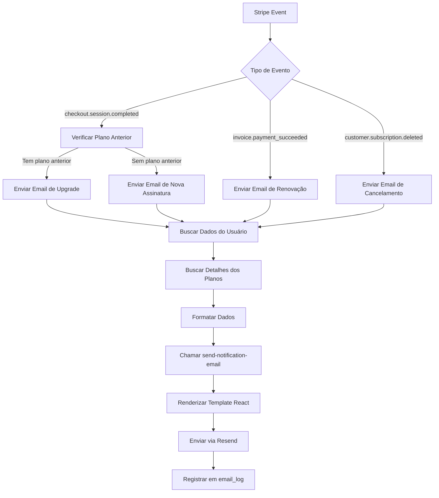

# ✅ Email de Mudança de Plano - Integrado no Webhook Stripe

## 🎯 O que foi Implementado

Integração completa de envio automático de emails de mudança de plano no **Webhook do Stripe**.

## 📍 Arquivo Modificado

**`supabase/functions/stripe-webhook/index.ts`**

## 🔄 Funcionalidades Adicionadas

### 1. Função Helper `sendSubscriptionEmail`

Nova função para processar e enviar emails de mudança de plano:

```typescript
async function sendSubscriptionEmail(
  supabaseAdmin: any,
  userId: string,
  changeType: 'upgrade' | 'downgrade' | 'cancelled' | 'renewed',
  newPlanId: string,
  oldPlanId?: string
)
```

**Responsabilidades:**
- ✅ Busca informações do usuário (nome, email)
- ✅ Busca detalhes dos planos (nome, preço, recursos)
- ✅ Calcula data de vigência da mudança
- ✅ Formata dados para o template de email
- ✅ Chama a edge function `send-notification-email`

### 2. Integração nos Eventos do Stripe

#### **checkout.session.completed**
```typescript
// Detecta se é novo plano ou upgrade/downgrade
if (existingSubscription?.plan_id && existingSubscription.plan_id !== planId) {
  // Upgrade ou downgrade
  await sendSubscriptionEmail(supabaseAdmin, userId, 'upgrade', planId, oldPlanId)
} else {
  // Nova assinatura (primeira vez)
  await sendSubscriptionEmail(supabaseAdmin, userId, 'renewed', planId)
}
```

**Quando dispara:**
- ✅ Usuário completa checkout de novo plano
- ✅ Usuário faz upgrade de plano

#### **invoice.payment_succeeded**
```typescript
await sendSubscriptionEmail(
  supabaseAdmin,
  subscription.partner_id,
  'renewed',
  subscription.plan_id
)
```

**Quando dispara:**
- ✅ Renovação automática mensal/anual do plano
- ✅ Pagamento recorrente bem-sucedido

#### **customer.subscription.deleted**
```typescript
await sendSubscriptionEmail(
  supabaseAdmin,
  dbSubscription.partner_id,
  'cancelled',
  dbSubscription.plan_id
)
```

**Quando dispara:**
- ✅ Usuário cancela assinatura
- ✅ Assinatura expira por falta de pagamento

## 📧 Tipos de Email Enviados

### 1. **Upgrade** 🎉
- **Quando**: Cliente muda para plano superior
- **Template**: "Parabéns pelo Upgrade!"
- **Conteúdo**: 
  - Nome do novo plano (destaque em azul)
  - Plano anterior
  - Data de vigência (imediata)
  - Novo valor mensal
  - Lista de recursos incluídos

### 2. **Renovação** ✅
- **Quando**: Pagamento recorrente confirmado ou primeira assinatura
- **Template**: "Assinatura Renovada!"
- **Conteúdo**:
  - Nome do plano renovado
  - Data de vigência
  - Valor mensal
  - Recursos incluídos

### 3. **Cancelamento** 😢
- **Quando**: Cliente cancela assinatura
- **Template**: "Cancelamento de Assinatura"
- **Conteúdo**:
  - Plano cancelado
  - Data até quando permanece ativo
  - Mensagem de despedida
  - Convite para feedback

## 📊 Dados Enviados no Email

```typescript
{
  clientName: "João Silva",
  changeType: "upgrade", // ou "downgrade", "cancelled", "renewed"
  oldPlan: "Básico",
  newPlan: "Profissional",
  effectiveDate: "15/01/2025",
  newPrice: 249.00,
  features: [
    "Clientes ilimitados",
    "Relatórios avançados",
    "Suporte prioritário"
  ]
}
```

## 🎨 Templates de Email

Os emails usam o template **SubscriptionChange** que inclui:
- ✅ Título dinâmico baseado no tipo de mudança
- ✅ Mensagem personalizada
- ✅ Destaque visual do novo plano (azul)
- ✅ Lista de recursos com checkmarks
- ✅ Link para acessar o painel
- ✅ Design profissional e responsivo

## 🧪 Como Testar

### Teste 1: Novo Plano (Checkout)
1. Acesse a página de **Planos**
2. Clique em "Assinar" em qualquer plano pago
3. Complete o checkout no Stripe (use cartão de teste)
4. ✅ Email de renovação ou upgrade deve ser enviado

**Cartão de teste:**
- Número: `4242 4242 4242 4242`
- Data: Qualquer data futura
- CVC: Qualquer 3 dígitos

### Teste 2: Renovação (Webhook Simulado)
No Stripe Dashboard:
1. Vá em **Developers → Webhooks**
2. Clique no webhook configurado
3. Clique em **Send test webhook**
4. Selecione `invoice.payment_succeeded`
5. ✅ Email de renovação deve ser enviado

### Teste 3: Cancelamento (Stripe Dashboard)
1. Vá em **Customers** no Stripe
2. Encontre o cliente de teste
3. Clique na assinatura ativa
4. Clique em **Cancel subscription**
5. ✅ Email de cancelamento deve ser enviado

## 📊 Monitoramento

### Ver Emails Enviados
```sql
SELECT 
  recipient,
  subject,
  template,
  status,
  sent_at
FROM email_log
WHERE template = 'subscription'
ORDER BY sent_at DESC
LIMIT 20;
```

### Ver Logs do Webhook
https://supabase.com/dashboard/project/lfsoxururyqknnjhrzxu/functions/stripe-webhook/logs

### Ver Logs da Edge Function de Email
https://supabase.com/dashboard/project/lfsoxururyqknnjhrzxu/functions/send-notification-email/logs

## 🔍 Fluxo Completo



## ⚠️ Tratamento de Erros

### Email Falha
- ✅ Não bloqueia processamento do webhook
- ✅ Erro logado no console
- ✅ Webhook retorna 200 OK mesmo assim
- ✅ Stripe não reenvia webhook por falha de email

### Usuário Sem Email
- ✅ Webhook processado normalmente
- ✅ Log indica "No email found for user"
- ✅ Assinatura atualizada no banco
- ✅ Nenhum erro retornado

### Graceful Degradation
- Se Resend estiver indisponível, o sistema continua
- Assinaturas são gerenciadas normalmente
- Apenas envio de email é afetado

## 🚀 Status das Integrações

### ✅ Concluído
- ✅ Email de agendamento (ao criar agendamento)
- ✅ Email de pagamento (ao confirmar pagamento)
- ✅ Email de mudança de plano (no webhook Stripe)

### 🔄 Próximos
- [ ] Email de lembrete 24h antes do agendamento
- [ ] Email de boas-vindas para novos usuários
- [ ] Email de ordem de serviço concluída
- [ ] Email de follow-up pós-serviço

## 📝 Notas Importantes

1. **Edge Functions Deployadas**:
   - ✅ `stripe-webhook` - atualizada com lógica de email
   - ✅ `send-notification-email` - pronta para receber chamadas

2. **Webhooks do Stripe**:
   - Certifique-se que o webhook está configurado em:
     - https://dashboard.stripe.com/test/webhooks
   - URL: `https://lfsoxururyqknnjhrzxu.supabase.co/functions/v1/stripe-webhook`
   - Eventos: 
     - `checkout.session.completed`
     - `invoice.payment_succeeded`
     - `customer.subscription.deleted`

3. **Secrets Necessários**:
   - ✅ `STRIPE_SECRET_KEY` - configurado
   - ✅ `STRIPE_WEBHOOK_SECRET` - configurado
   - ✅ `RESEND_API_KEY` - configurado

4. **Rate Limiting**:
   - Webhook tem proteção contra spam
   - Limite configurado em `RATE_LIMIT_PRESETS.webhook`

5. **Auditoria**:
   - Todos eventos processados são logados
   - Emails enviados registrados em `email_log`
   - Request IDs para rastreamento end-to-end

## 🎯 Resultado

Os clientes agora recebem automaticamente:
- ✅ Confirmação de novo plano por email
- ✅ Notificação de upgrade profissional
- ✅ Comprovante de renovação mensal/anual
- ✅ Aviso de cancelamento com despedida
- ✅ Melhor comunicação sobre mudanças de assinatura
- ✅ Transparência total no ciclo de vida da assinatura

## 🔗 Links Úteis

- **Stripe Dashboard**: https://dashboard.stripe.com/test/dashboard
- **Webhooks**: https://dashboard.stripe.com/test/webhooks
- **Resend Emails**: https://resend.com/emails
- **Edge Function Logs**: https://supabase.com/dashboard/project/lfsoxururyqknnjhrzxu/functions
