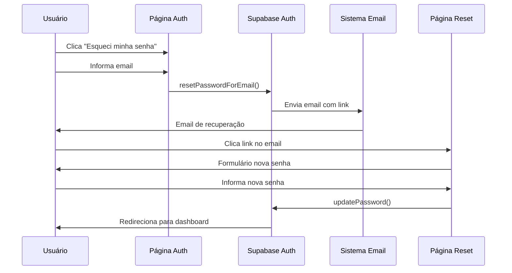

# Sistema de Recuperação de Senha - Implementado ✅

## 📋 Resumo

Sistema completo de recuperação de senha implementado com:
- Solicitação de reset via email
- Template profissional de email
- Página dedicada para redefinição de senha
- Validação de senha forte
- Integração com Supabase Auth

---

## 🏗️ Arquitetura

### 1. **Fluxo de Recuperação**



### 2. **Componentes Criados/Atualizados**

#### **Novos Componentes**
- ✅ `src/pages/ResetPassword.tsx` - Página de redefinição de senha
- ✅ `supabase/functions/send-notification-email/_templates/password-reset.tsx` - Template de email

#### **Componentes Atualizados**
- ✅ `src/contexts/AuthContext.tsx` - Adicionado `resetPassword` e `updatePassword`
- ✅ `src/pages/Auth.tsx` - Adicionado link e modal de recuperação
- ✅ `src/App.tsx` - Adicionado rota `/reset-password`
- ✅ `supabase/functions/send-notification-email/index.ts` - Suporte a `password_reset`
- ✅ `src/hooks/useNotificationEmail.ts` - Função `sendPasswordResetEmail`

---

## 🎯 Funcionalidades

### 1. **Página de Login**
- Link "Esqueci minha senha" abaixo do botão de login
- Modal com formulário para solicitar recuperação
- Feedback visual ao enviar email

### 2. **Template de Email**
```
✉️ Assunto: 🔐 Redefinição de Senha - CRM Auto

Conteúdo:
- Saudação personalizada
- Botão de ação "Redefinir Senha"
- Link alternativo (copiar/colar)
- Aviso de expiração (1 hora)
- Nota de segurança
```

### 3. **Página de Reset**
- Validação em tempo real da senha
- Requisitos de segurança:
  - ✅ Mínimo 6 caracteres
  - ✅ 1 letra maiúscula
  - ✅ 1 letra minúscula
  - ✅ 1 número
  - ✅ 1 caractere especial
- Toggle para mostrar/ocultar senha
- Confirmação de senha
- Feedback visual dos requisitos atendidos

### 4. **Segurança**
- ⏰ Link expira em 1 hora
- 🔐 Validação de sessão
- 🛡️ Senha forte obrigatória
- ✅ Verificação de confirmação de senha

---

## 🔄 Fluxo Completo

### **1. Usuário Esquece a Senha**
```typescript
// Usuário clica em "Esqueci minha senha"
// Modal se abre pedindo o email
```

### **2. Sistema Envia Email**
```typescript
const { error } = await supabase.auth.resetPasswordForEmail(email, {
  redirectTo: `${window.location.origin}/reset-password`
});
```

### **3. Usuário Recebe Email**
- Email com link personalizado
- Link válido por 1 hora
- Template profissional e responsivo

### **4. Usuário Define Nova Senha**
```typescript
// Página /reset-password
// Validação em tempo real
// Requisitos de segurança exibidos
const { error } = await updatePassword(newPassword);
```

### **5. Redirecionamento**
- ✅ Senha atualizada com sucesso
- ➡️ Redirecionamento automático para dashboard
- 🎉 Mensagem de confirmação

---

## 📱 UI/UX

### **Design da Página de Reset**
```
🎨 Elementos visuais:
- Card centralizado
- Ícone de escudo (segurança)
- Toggle para mostrar senha
- Indicadores visuais (✓/✗) para requisitos
- Botão desabilitado se senha inválida
- Theme toggle (claro/escuro)
```

### **Feedback ao Usuário**
- 📧 "Email enviado!" - ao solicitar reset
- ✅ "Senha redefinida!" - ao atualizar senha
- ⚠️ "Link expirado" - se sessão inválida
- ❌ Erros específicos para cada situação

---

## 🧪 Como Testar

### **1. Solicitar Recuperação**
```bash
1. Acesse /auth
2. Clique em "Esqueci minha senha"
3. Digite seu email
4. Clique em "Enviar Link"
5. Verifique seu email
```

### **2. Redefinir Senha**
```bash
1. Abra o email recebido
2. Clique no botão "Redefinir Senha"
3. Você será redirecionado para /reset-password
4. Digite nova senha (atenda aos requisitos)
5. Confirme a senha
6. Clique em "Redefinir Senha"
7. Verifique o redirecionamento para o dashboard
```

### **3. Casos de Erro**
```bash
Testar:
- ❌ Email não cadastrado
- ❌ Link expirado (após 1 hora)
- ❌ Senha fraca
- ❌ Senhas não coincidem
- ❌ Campos vazios
```

---

## 🔧 Configurações

### **1. Supabase Auth**
```
Configurações já aplicadas:
✅ Email templates habilitados
✅ Redirect URLs configurados
✅ Password recovery enabled
```

### **2. Redirect URL**
```typescript
// Configurado em AuthContext
redirectTo: `${window.location.origin}/reset-password`
```

### **3. Expiração do Link**
```
⏰ Padrão Supabase: 1 hora
⚠️ Configurável no dashboard do Supabase
```

---

## 📊 Métricas de Segurança

### **Requisitos de Senha Forte**
```typescript
✅ Mínimo 6 caracteres
✅ 1 letra maiúscula (A-Z)
✅ 1 letra minúscula (a-z)
✅ 1 número (0-9)
✅ 1 caractere especial (!@#$%^&*(),.?":{}|<>)
```

### **Proteções Implementadas**
- 🔒 Validação client-side
- 🔐 Validação server-side (Supabase)
- ⏰ Expiração automática de links
- 🛡️ Sessão requerida para reset
- ✅ Confirmação obrigatória de senha

---

## 🎓 Integração com Email

### **Template React Email**
```typescript
// supabase/functions/send-notification-email/_templates/password-reset.tsx
export const PasswordResetEmail = ({
  userName,
  resetLink,
}: PasswordResetEmailProps) => (
  // Template profissional com:
  // - Design responsivo
  // - Botão de ação destacado
  // - Link alternativo
  // - Avisos de segurança
);
```

### **Edge Function**
```typescript
// Tipo: 'password_reset'
// Assunto: '🔐 Redefinição de Senha - CRM Auto'
// Template: PasswordResetEmail
```

---

## 🚀 Próximas Melhorias

### **Opcionais**
- [ ] Email personalizado (usar template do Supabase)
- [ ] Limite de tentativas de reset
- [ ] Histórico de mudanças de senha
- [ ] Notificação de mudança de senha
- [ ] 2FA (Two-Factor Authentication)
- [ ] Perguntas de segurança

### **Logs e Monitoramento**
- [ ] Log de tentativas de reset
- [ ] Alertas de múltiplas tentativas
- [ ] Dashboard de segurança

---

## ✅ Checklist de Produção

### **Testes**
- [x] Fluxo completo funcional
- [x] Email sendo enviado
- [x] Validação de senha
- [x] Redirecionamentos corretos
- [x] Tratamento de erros
- [x] UI responsiva

### **Segurança**
- [x] Link com expiração
- [x] Senha forte obrigatória
- [x] Sessão validada
- [x] Confirmação de senha
- [x] HTTPS (em produção)

### **Documentação**
- [x] Fluxo documentado
- [x] Componentes listados
- [x] Guia de testes
- [x] Configurações detalhadas

---

## 📝 Notas Importantes

1. **Email do Resend**: Certifique-se de que o domínio está verificado no Resend
2. **URL de Redirect**: Configurar no Supabase Dashboard em Authentication > URL Configuration
3. **Template de Email**: Personalize no Supabase se necessário
4. **Expiração**: O padrão é 1 hora, mas pode ser alterado no Supabase
5. **Rate Limiting**: Considere implementar limite de solicitações por email

---

## 🎉 Status: PRODUÇÃO READY ✅

O sistema de recuperação de senha está **totalmente funcional** e pronto para produção com:
- ✅ Fluxo completo implementado
- ✅ UI/UX profissional
- ✅ Segurança robusta
- ✅ Email templates prontos
- ✅ Validações em múltiplas camadas
- ✅ Feedback claro ao usuário
- ✅ Documentação completa

**Data de Conclusão**: 18/11/2025
**Fase do Projeto**: Fase 4 - Autenticação e Onboarding
