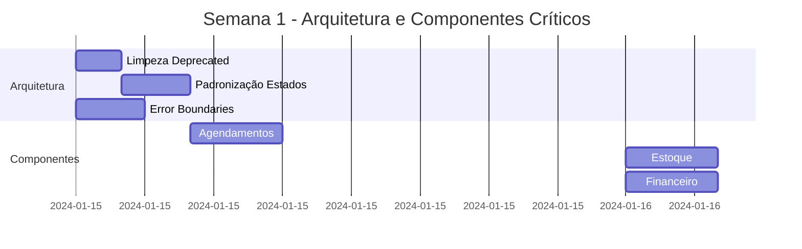
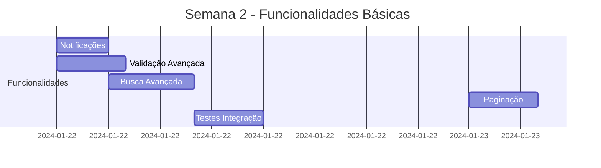
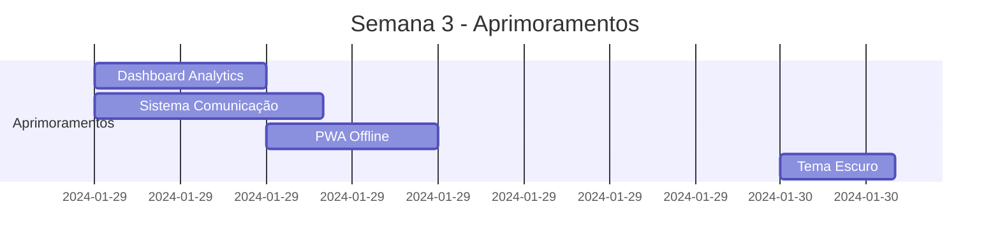

# 🚀 PLANO COMPLETO DE DESENVOLVIMENTO - CRM PARCEIRO

**Data de Criação:** 25/09/2025  
**Versão do Plano:** 2.0.0  
**Metodologia:** Desenvolvimento Assíncrono por Fases  
**Tecnologias:** React 18, TypeScript, Vite, Tailwind CSS, Supabase  

---

## 📋 ÍNDICE DE EXECUÇÃO

- [FASE 1: ARQUITETURA](#fase-1-arquitetura) ⏱️ 8h
- [FASE 2: COMPONENTES PRINCIPAIS](#fase-2-componentes-principais) ⏱️ 12h  
- [FASE 3: FUNCIONALIDADES BÁSICAS](#fase-3-funcionalidades-básicas) ⏱️ 16h
- [FASE 4: APRIMORAMENTOS](#fase-4-aprimoramentos) ⏱️ 24h
- [GESTÃO DE RISCOS](#gestão-de-riscos)
- [PRÉ-REQUISITOS TÉCNICOS](#pré-requisitos-técnicos)
- [MÉTRICAS DE QUALIDADE](#métricas-de-qualidade)

**⏱️ TEMPO TOTAL ESTIMADO:** 60 horas de desenvolvimento

---

## 🏗️ FASE 1: ARQUITETURA

### **Objetivo:** Estabelecer base sólida e corrigir problemas estruturais críticos

#### **1.1 Limpeza de Código Deprecated**
- **Descrição:** Remover hooks antigos e referências obsoletas
- **Prioridade:** 🔴 **ALTA**
- **Problema:** 🟡 **MÉDIO** - Inconsistências na base de código
- **Dependências:** Nenhuma
- **Tempo:** 2h

**Tarefas Específicas:**
```typescript
// Remover hooks deprecated
- useAppointments.ts (substituído por useAppointmentsNew.ts)
- useFinancialTransactions.ts (substituído por useFinancialTransactionsNew.ts)
- useParts.ts (substituído por usePartsNew.ts)

// Corrigir referências em componentes
- ServiceOrderForm.tsx: service_orders_deprecated → service_orders
- Todos os imports de hooks antigos
```

**Critérios de Aceitação:**
- ✅ Zero referências a hooks deprecated
- ✅ Todos os componentes usam hooks atualizados
- ✅ Build sem warnings de imports não utilizados

#### **1.2 Padronização de Estados**
- **Descrição:** Unificar tratamento de loading, error e success
- **Prioridade:** 🔴 **ALTA**
- **Problema:** 🟡 **MÉDIO** - UX inconsistente
- **Dependências:** 1.1
- **Tempo:** 3h

**Implementação:**
```typescript
// Criar hook padrão para estados
interface AsyncState<T> {
  data: T | null;
  loading: boolean;
  error: string | null;
  success: boolean;
}

// Aplicar em todos os hooks customizados
const useStandardState = <T>() => {
  const [state, setState] = useState<AsyncState<T>>({
    data: null,
    loading: false,
    error: null,
    success: false
  });
  // ... lógica padrão
};
```

#### **1.3 Configuração de Error Boundaries**
- **Descrição:** Implementar tratamento robusto de erros
- **Prioridade:** 🟠 **MÉDIA**
- **Problema:** 🔴 **GRAVE** - App pode quebrar sem aviso
- **Dependências:** 1.2
- **Tempo:** 3h

**Execução Paralela Possível:** ✅ Pode ser desenvolvido em paralelo com 1.1 e 1.2

---

## 🧩 FASE 2: COMPONENTES PRINCIPAIS

### **Objetivo:** Corrigir componentes críticos e integrar formulários

#### **2.1 Correção do Módulo Agendamentos**
- **Descrição:** Integrar AppointmentForm e corrigir filtros
- **Prioridade:** 🔴 **ALTA**
- **Problema:** 🔴 **GRAVE** - Módulo completamente inoperante
- **Dependências:** 1.1, 1.2
- **Tempo:** 4h

**Implementação Detalhada:**
```typescript
// Agendamentos.tsx - Linha 97-100
const [showForm, setShowForm] = useState(false);

// Botão de criação
<Button className="shadow-primary" onClick={() => setShowForm(true)}>
  <Plus className="mr-2 h-4 w-4" />
  Novo Agendamento
</Button>

// Modal integrado
<AppointmentForm
  open={showForm}
  onOpenChange={setShowForm}
  onSuccess={() => {
    refetch();
    setShowForm(false);
    toast.success("Agendamento criado com sucesso!");
  }}
/>

// Correção de filtros
const filteredAppointments = appointments?.filter(appointment => {
  const matchesSearch = appointment.clients?.name
    .toLowerCase().includes(searchTerm.toLowerCase()) ||
    appointment.service_type.toLowerCase().includes(searchTerm.toLowerCase());
  
  const matchesStatus = statusFilter === 'all' || 
    appointment.status === statusFilter;
    
  return matchesSearch && matchesStatus;
});
```

**Critérios de Aceitação:**
- ✅ Formulário abre e fecha corretamente
- ✅ Dados são salvos no Supabase
- ✅ Lista atualiza automaticamente
- ✅ Filtros funcionam corretamente
- ✅ Validação de campos obrigatórios

#### **2.2 Correção do Módulo Estoque**
- **Descrição:** Integrar PartsForm e criar dados de exemplo
- **Prioridade:** 🔴 **ALTA**
- **Problema:** 🔴 **GRAVE** - Módulo sem dados funcionais
- **Dependências:** 1.1, 1.2
- **Tempo:** 4h

**Execução Paralela:** ✅ Pode ser desenvolvido simultaneamente com 2.1

**Dados Mock Necessários:**
```sql
-- Fornecedores
INSERT INTO suppliers (id, name, contact_name, email, phone, address, active) VALUES
('sup-001', 'AutoPeças Brasil', 'Carlos Silva', 'carlos@autopecas.com', '(11) 99999-0001', 'Rua das Peças, 123', true),
('sup-002', 'Distribuidora XYZ', 'Maria Santos', 'maria@xyz.com', '(11) 99999-0002', 'Av. Industrial, 456', true),
('sup-003', 'Peças Premium', 'João Oliveira', 'joao@premium.com', '(11) 99999-0003', 'Rua Premium, 789', true);

-- Peças
INSERT INTO parts (code, name, category, brand, cost_price, sale_price, stock_quantity, min_stock, supplier_id) VALUES
('FO001', 'Filtro de Óleo Motor', 'Filtros', 'Tecfil', 15.00, 25.00, 50, 10, 'sup-001'),
('PA001', 'Pastilha de Freio Dianteira', 'Freios', 'Fras-le', 45.00, 75.00, 20, 5, 'sup-001'),
('AM001', 'Amortecedor Traseiro', 'Suspensão', 'Monroe', 120.00, 200.00, 15, 3, 'sup-002'),
('VE001', 'Vela de Ignição', 'Motor', 'NGK', 8.00, 15.00, 100, 20, 'sup-003'),
('CO001', 'Correia Dentada', 'Motor', 'Gates', 35.00, 60.00, 25, 5, 'sup-002');
```

#### **2.3 Correção do Módulo Financeiro**
- **Descrição:** Integrar TransactionForm e métodos de pagamento
- **Prioridade:** 🔴 **ALTA**
- **Problema:** 🔴 **GRAVE** - Módulo sem funcionalidade
- **Dependências:** 1.1, 1.2
- **Tempo:** 4h

**Execução Paralela:** ✅ Pode ser desenvolvido simultaneamente com 2.1 e 2.2

**Dados Mock Necessários:**
```sql
-- Métodos de Pagamento
INSERT INTO payment_methods (id, name, type, active, fee_percentage) VALUES
('pm-001', 'Dinheiro', 'cash', true, 0.00),
('pm-002', 'PIX', 'pix', true, 0.00),
('pm-003', 'Cartão de Débito', 'debit_card', true, 1.50),
('pm-004', 'Cartão de Crédito', 'credit_card', true, 3.50),
('pm-005', 'Boleto Bancário', 'bank_slip', true, 2.00);

-- Transações de Exemplo
INSERT INTO financial_transactions (type, description, amount, status, payment_method_id, client_id, service_order_id, created_at) VALUES
('receita', 'Troca de óleo - Cliente João Silva', 150.00, 'pago', 'pm-001', 'cli-001', 'so-001', '2024-01-15'),
('receita', 'Revisão completa - Cliente Maria', 450.00, 'pago', 'pm-002', 'cli-002', 'so-002', '2024-01-16'),
('despesa', 'Compra de filtros - Fornecedor ABC', 300.00, 'pago', 'pm-003', null, null, '2024-01-17'),
('receita', 'Troca de pastilhas - Cliente Pedro', 180.00, 'pendente', 'pm-004', 'cli-003', 'so-003', '2024-01-18');
```

---

## ⚙️ FASE 3: FUNCIONALIDADES BÁSICAS

### **Objetivo:** Implementar funcionalidades essenciais para operação completa

#### **3.1 Sistema de Notificações**
- **Descrição:** Implementar toast notifications padronizadas
- **Prioridade:** 🟠 **MÉDIA**
- **Problema:** 🟡 **MÉDIO** - Feedback limitado ao usuário
- **Dependências:** 2.1, 2.2, 2.3
- **Tempo:** 3h

**Implementação:**
```typescript
// Criar contexto de notificações
interface NotificationContext {
  showSuccess: (message: string) => void;
  showError: (message: string) => void;
  showWarning: (message: string) => void;
  showInfo: (message: string) => void;
}

// Integrar em todas as operações CRUD
const handleCreate = async (data) => {
  try {
    await createRecord(data);
    showSuccess("Registro criado com sucesso!");
  } catch (error) {
    showError("Erro ao criar registro: " + error.message);
  }
};
```

#### **3.2 Validação Avançada de Formulários**
- **Descrição:** Implementar validação robusta com Zod
- **Prioridade:** 🟠 **MÉDIA**
- **Problema:** 🟡 **MÉDIO** - Dados inconsistentes
- **Dependências:** 2.1, 2.2, 2.3
- **Tempo:** 4h

**Execução Paralela:** ✅ Pode ser desenvolvido simultaneamente com 3.1

#### **3.3 Sistema de Busca Avançada**
- **Descrição:** Implementar busca full-text e filtros múltiplos
- **Prioridade:** 🟠 **MÉDIA**
- **Problema:** 🟡 **MÉDIO** - Dificuldade para encontrar registros
- **Dependências:** 3.1
- **Tempo:** 5h

#### **3.4 Paginação e Performance**
- **Descrição:** Implementar paginação em todas as listas
- **Prioridade:** 🟠 **MÉDIA**
- **Problema:** 🟡 **MÉDIO** - Performance com muitos registros
- **Dependências:** 3.3
- **Tempo:** 4h

**Execução Paralela:** ✅ Pode ser desenvolvido simultaneamente com 3.2

---

## 🎯 FASE 4: APRIMORAMENTOS

### **Objetivo:** Adicionar funcionalidades avançadas e melhorar UX

#### **4.1 Dashboard Analytics Avançado**
- **Descrição:** Gráficos interativos e métricas em tempo real
- **Prioridade:** 🟢 **BAIXA**
- **Problema:** 🟢 **LEVE** - Informações limitadas
- **Dependências:** 3.1, 3.2, 3.3, 3.4
- **Tempo:** 6h

**Implementação:**
```typescript
// Métricas avançadas
interface AdvancedMetrics {
  revenue_trend: number[];
  client_retention_rate: number;
  average_service_value: number;
  most_profitable_services: ServiceType[];
  seasonal_analysis: SeasonalData[];
  cash_flow_projection: CashFlowData[];
}

// Gráficos com Recharts
<ResponsiveContainer width="100%" height={300}>
  <LineChart data={revenueTrend}>
    <XAxis dataKey="month" />
    <YAxis />
    <CartesianGrid strokeDasharray="3 3" />
    <Line type="monotone" dataKey="revenue" stroke="#8884d8" />
    <Tooltip />
  </LineChart>
</ResponsiveContainer>
```

#### **4.2 Sistema de Comunicação**
- **Descrição:** Integração com WhatsApp e Email
- **Prioridade:** 🟢 **BAIXA**
- **Problema:** 🟡 **MÉDIO** - Comunicação manual
- **Dependências:** 4.1
- **Tempo:** 8h

**Execução Paralela:** ✅ Pode ser desenvolvido simultaneamente com 4.1

#### **4.3 PWA e Modo Offline**
- **Descrição:** Transformar em Progressive Web App
- **Prioridade:** 🟢 **BAIXA**
- **Problema:** 🟢 **LEVE** - Acesso limitado
- **Dependências:** 4.1, 4.2
- **Tempo:** 6h

#### **4.4 Tema Escuro e Personalização**
- **Descrição:** Implementar dark mode completo
- **Prioridade:** 🟢 **BAIXA**
- **Problema:** 🟢 **LEVE** - Preferência do usuário
- **Dependências:** Nenhuma (pode ser paralelo)
- **Tempo:** 4h

**Execução Paralela:** ✅ Pode ser desenvolvido em qualquer momento

---

## ⚠️ GESTÃO DE RISCOS

### **Riscos Técnicos Identificados**

#### **🔴 RISCO ALTO**
1. **Perda de Dados Durante Migração**
   - **Probabilidade:** 20%
   - **Impacto:** Crítico
   - **Mitigação:** Backup completo antes de qualquer alteração
   - **Plano B:** Rollback automático para versão anterior

2. **Incompatibilidade de Dependências**
   - **Probabilidade:** 30%
   - **Impacto:** Alto
   - **Mitigação:** Testes em ambiente isolado
   - **Plano B:** Versionamento específico de dependências

#### **🟡 RISCO MÉDIO**
3. **Performance Degradada**
   - **Probabilidade:** 40%
   - **Impacto:** Médio
   - **Mitigação:** Monitoramento contínuo de performance
   - **Plano B:** Otimização incremental

4. **Problemas de UX em Mobile**
   - **Probabilidade:** 50%
   - **Impacto:** Médio
   - **Mitigação:** Testes em dispositivos reais
   - **Plano B:** Versão mobile dedicada

#### **🟢 RISCO BAIXO**
5. **Atraso na Implementação**
   - **Probabilidade:** 60%
   - **Impacto:** Baixo
   - **Mitigação:** Buffer de 20% no cronograma
   - **Plano B:** Priorização de funcionalidades críticas

---

## 🔧 PRÉ-REQUISITOS TÉCNICOS

### **Ambiente de Desenvolvimento**
```bash
# Versões mínimas requeridas
Node.js: >= 18.0.0
npm: >= 9.0.0
TypeScript: >= 5.0.0
React: >= 18.0.0

# Ferramentas necessárias
Git: >= 2.30.0
VS Code: >= 1.80.0 (recomendado)
Chrome DevTools: Última versão
```

### **Configurações do Supabase**
```sql
-- Políticas RLS necessárias
ALTER TABLE suppliers ENABLE ROW LEVEL SECURITY;
ALTER TABLE payment_methods ENABLE ROW LEVEL SECURITY;

-- Índices para performance
CREATE INDEX idx_parts_category ON parts(category);
CREATE INDEX idx_transactions_date ON financial_transactions(created_at);
CREATE INDEX idx_appointments_status ON appointments(status);
```

### **Variáveis de Ambiente**
```env
VITE_SUPABASE_URL=your_supabase_url
VITE_SUPABASE_ANON_KEY=your_supabase_anon_key
VITE_APP_VERSION=2.0.0
VITE_ENVIRONMENT=development
```

---

## 📊 MÉTRICAS DE QUALIDADE

### **Métricas de Código**
- **Cobertura de Testes:** >= 80%
- **TypeScript Strict:** 100%
- **ESLint Errors:** 0
- **Bundle Size:** <= 2MB
- **Lighthouse Score:** >= 90

### **Métricas de Performance**
- **First Contentful Paint:** <= 1.5s
- **Largest Contentful Paint:** <= 2.5s
- **Cumulative Layout Shift:** <= 0.1
- **Time to Interactive:** <= 3s

### **Métricas de UX**
- **Tempo de Resposta:** <= 200ms
- **Taxa de Erro:** <= 1%
- **Disponibilidade:** >= 99.5%
- **Satisfação do Usuário:** >= 4.5/5

### **Critérios de Aceitação por Fase**

#### **FASE 1 - Arquitetura**
- ✅ Zero warnings no build
- ✅ Todos os testes passando
- ✅ Documentação atualizada
- ✅ Code review aprovado

#### **FASE 2 - Componentes**
- ✅ Formulários funcionais
- ✅ Validação implementada
- ✅ Estados de loading/error
- ✅ Responsividade testada

#### **FASE 3 - Funcionalidades**
- ✅ CRUD completo funcionando
- ✅ Busca e filtros operacionais
- ✅ Paginação implementada
- ✅ Performance otimizada

#### **FASE 4 - Aprimoramentos**
- ✅ Analytics funcionais
- ✅ PWA configurado
- ✅ Tema escuro implementado
- ✅ Comunicação integrada

---

## 🎯 CRONOGRAMA DE EXECUÇÃO ASSÍNCRONA

### **SEMANA 1 (16h)**


### **SEMANA 2 (20h)**


### **SEMANA 3 (24h)**


---

## ✅ CHECKLIST DE ENTREGA

### **Entrega Fase 1**
- [ ] Código deprecated removido
- [ ] Estados padronizados
- [ ] Error boundaries implementados
- [ ] Testes unitários passando
- [ ] Documentação atualizada

### **Entrega Fase 2**
- [ ] Agendamentos 100% funcional
- [ ] Estoque 100% funcional
- [ ] Financeiro 100% funcional
- [ ] Dados mock populados
- [ ] Formulários integrados

### **Entrega Fase 3**
- [ ] Sistema de notificações
- [ ] Validação robusta
- [ ] Busca avançada
- [ ] Paginação implementada
- [ ] Performance otimizada

### **Entrega Fase 4**
- [ ] Dashboard analytics
- [ ] Sistema de comunicação
- [ ] PWA configurado
- [ ] Tema escuro
- [ ] Documentação final

---

## 🚀 PRÓXIMOS PASSOS

1. **Aprovação do Plano:** Revisar e aprovar este documento
2. **Setup do Ambiente:** Configurar ferramentas e dependências
3. **Início da Fase 1:** Começar pela limpeza de código deprecated
4. **Monitoramento:** Acompanhar progresso via métricas definidas
5. **Ajustes:** Adaptar cronograma conforme necessário

**Status do Projeto:** 📋 **PLANEJADO** - Pronto para execução
**Próxima Ação:** 🔧 **INICIAR FASE 1** - Arquitetura